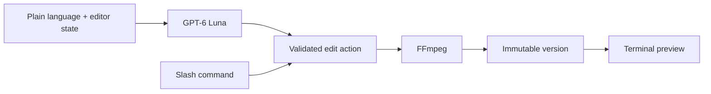

# DumbEditor

**A zero UX video editor that lives entirely in your terminal.**

DumbEditor turns ordinary language into small, reversible FFmpeg edits. GPT-6 Luna understands the request and selects a validated built-in operation. Slash commands provide a direct path when you already know what you want. The source video is never overwritten.

## Current features

- High resolution Sixel video preview in supported terminals, with an ANSI fallback
- Player height matched to the video aspect ratio, with the timeline and chat directly below it
- Stable player and chat surfaces during playback
- Play, pause, five second seeking, preview audio, and volume controls
- Plain language removal, trimming, speed, mute, and crop requests through GPT-6 Luna
- Discoverable slash command menu with keyboard selection and completion
- Wide-screen version and session sidebars around the video preview
- Progress indicators for AI interpretation, FFmpeg rendering, output checks, and version saving
- Version history with undo, revert, branching, export, and configurable retention
- OpenAI and OpenRouter model defaults backed by each provider's live catalog

## Requirements

- Node.js 20 or newer
- `ffmpeg`, `ffprobe`, and optionally `ffplay` on `PATH`
- Windows Terminal 1.22+ or another Sixel terminal for the high resolution preview
- An OpenAI API key

## Install and run

```bash
npm install
npm run build
npm link

dumbeditor
dumbeditor setup
dumbeditor video.mp4
```

During development:

```bash
npm run dev -- video.mp4
```

Running `dumbeditor` without arguments prints a clean project overview. On the first launch it also explains the problem DumbEditor is built to solve and the two commands needed to begin. `dumbeditor --help` prints the complete CLI, editor command, control, time format, and example reference.

`dumbeditor setup` asks for a required OpenAI key and an optional OpenRouter key using hidden terminal input. It stores keys in `~/.dumbeditor/.env`. Model choices are stored separately in `~/.dumbeditor/settings.json`. The setup-managed user config takes precedence, followed by a current-directory `.env` and the package-local development `.env`. All `.env` files are excluded from Git.

The editor model defaults to `gpt-6-luna`. Use `/model` inside the editor to view OpenAI and OpenRouter defaults, load the providers' current model catalogs, and select another model.

## Natural language editing

Write requests as you normally would. You do not need to memorize timestamp syntax.

```text
remove the first two seconds and the last ten seconds
keep only the part from 00:10 through 00:42
make this marked section twice as fast
mute the next five seconds
crop the video to 1280 by 720
```

The model receives the current duration, playhead, marked range, and recent project conversation. It returns one typed edit action. DumbEditor validates the values before running FFmpeg.

## Slash commands

Type `/` to open the command menu. Use `↑` and `↓` to choose, then `Tab` or `Enter` to complete a command.

```text
/clip-remove <FROM> <TO> [FROM TO ...]
/clip-keep <FROM> <TO>
/speed <FROM> <TO> <FACTOR>
/mute <FROM> <TO>
/crop <WIDTH>x<HEIGHT> [X,Y]
/open <VIDEO PATH>
/version [all]
/version-limits [1-100]
/revert <VERSION>
/undo
/export <OUTPUT PATH>
/model
/model openai [MODEL]
/model openrouter [text|image|audio|music|video] [MODEL]
/status
/play
/pause
/clear
/help
/quit
```

Direct time arguments accept seconds, `mm:ss`, `hh:mm:ss`, `start`, `end`, `playhead`, `in`, and `out`.

`/version-limits` reports the current retention limit. `/version-limits 10` keeps the ten newest rendered edits plus the original source. The default is five. Pruned renders are removed from the project directory while the source is always preserved.

`/model` opens both provider sections. `/model openai` lists available OpenAI editor models. `/model openrouter image` lists the current image-capable OpenRouter models; the same form accepts `text`, `audio`, `music`, or `video`. Add a model ID to save it as that capability's default. OpenRouter execution will be added with the workflows that use those capabilities.

## Controls

| Input | Action |
| --- | --- |
| `Space` | Play or pause |
| `←` / `→` | Seek backward or forward five seconds |
| `↑` / `↓` | Change volume, or move through command suggestions |
| `[` / `]` | Set the in and out marks |
| `Tab` | Complete the selected command |
| `Enter` | Send a request or choose a command |
| `Esc` | Clear input or close a panel |
| `Ctrl+C` | Quit |

## Preview backend

DumbEditor automatically uses Sixel in Windows Terminal and terminals that advertise Sixel support. Frames are scaled with Lanczos and painted only inside the reserved player surface. The timeline updates independently from the conversation.

Force the portable block renderer when needed:

```powershell
$env:DUMBEDITOR_PREVIEW = "blocks"
dumbeditor video.mp4
```

`DUMBEDITOR_CELL_WIDTH` and `DUMBEDITOR_CELL_HEIGHT` override the estimated terminal cell size used to fit Sixel images. The defaults target Windows Terminal with Cascadia Mono.

## Architecture



Each source gets a project directory beside it:

```text
.dumbeditor/<video-name>-<hash>/
  project.json
  chat.jsonl
  versions/
```

Reverting changes the active version pointer, so a new edit after a revert creates a branch. Retention keeps the original source and the configured number of rendered edits.

## Development

```bash
npm run quality
```

## License

MIT
