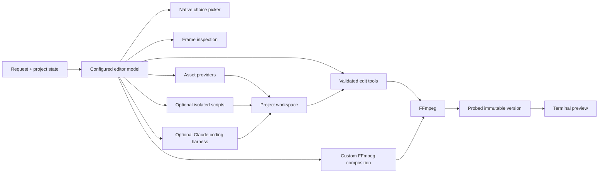

# DumbEditor

**Direct, agent-first video editing in the terminal.**

```bash
npx dumbeditor@latest setup
npx dumbeditor@latest "./video.mp4"
```

DumbEditor is the first tool in **DUMB: Direct Unbounded Media Builder**.

DUMB is a growing family of minimal, open source, agent-first creative tools. DumbEditor starts with video. The same idea can extend to files, presentations, spreadsheets, painting, animation, and visualization without turning each job into another large application or subscription.

## Why DUMB exists

Most creative software exposes its internal machinery first: panels, timelines, menus, modes, and hundreds of controls. The user has to learn the application before making the thing they already understand.

Adding a chat box to that interface does not make the software AI native. An AI-native tool begins with intent. It gives an agent the context, tools, workspace, permissions, and feedback loop required to finish the work, while keeping deterministic controls available when they are faster.

DumbEditor follows four rules:

1. **Say the result.** Write a normal request instead of translating it into a sequence of UI operations.
2. **Use direct commands when useful.** Slash commands handle precise edits immediately and remain discoverable with `/`.
3. **Keep work local and reversible.** FFmpeg performs the edit, source media stays untouched, and every render becomes a version.
4. **Make cost and agency visible.** Model choices, permissions, generated assets, provenance, and running costs stay in the editor instead of disappearing behind a subscription.

The goal is capable software with a small surface: one terminal, one conversation, direct controls, and an agent that can inspect its output.

## DumbEditor in action

<p align="center">
  
</p>

<p align="center"><em>The editor agent transcribes speech while the video, timeline, version history, assets, cost, and progress stay visible.</em></p>

## Install

### Run without installing

`npx` downloads the current package into npm's cache and runs its single `dumbeditor` executable:

```bash
npx dumbeditor@latest setup
npx dumbeditor@latest "./video.mp4"
npx dumbeditor@latest --help
```

Use `@latest` to request the current npm release. On first use, npm may ask permission to download the package.

### Install the command globally

For regular use:

```bash
npm install --global dumbeditor
dumbeditor setup
dumbeditor "./video.mp4"
```

### Run from source

```bash
git clone https://github.com/shing1Sks/DumbEditor.git
cd DumbEditor
npm install
npm run build
npm link
dumbeditor setup
dumbeditor "./video.mp4"
```

For development, use `npm run dev -- "./video.mp4"`.

## Requirements and platform support

- Node.js 20.11 or newer
- `ffmpeg` and `ffprobe` on `PATH`
- `ffplay` on `PATH` for preview audio and catalog music auditioning
- An OpenAI API key for the default editor agent
- An optional OpenRouter key for alternate agents and image, music, or video generation
- An optional Anthropic API key for the Claude coding harness

Common FFmpeg installations:

```powershell
# Windows
winget install Gyan.FFmpeg
```

```bash
# macOS with Homebrew
brew install ffmpeg

# Ubuntu / Debian
sudo apt update && sudo apt install ffmpeg
```

| Platform | Core editor | Inline preview | Agent script sandbox |
| --- | --- | --- | --- |
| Windows 10/11 | Supported and currently developed here | High resolution Sixel in recent Windows Terminal; ANSI fallback | One-time setup with a UAC prompt |
| macOS | Portable Node and FFmpeg path; covered by build/startup CI | Sixel when advertised by the terminal; ANSI fallback | Available when Sandbox Runtime dependencies pass their check |
| Linux | Portable Node and FFmpeg path; full test suite runs in CI | Sixel when advertised by the terminal; ANSI fallback | Available when Sandbox Runtime dependencies pass their check |

The prepared editing tools, versions, exports, model calls, and ANSI renderer do not require the optional script sandbox. Set `DUMBEDITOR_PREVIEW=blocks` to force the universal ANSI renderer.

## First setup

`dumbeditor setup` securely prompts for provider keys. It writes them to `~/.dumbeditor/.env`; model choices and permission mode live in `~/.dumbeditor/settings.json`. Keys are not stored in projects, printed in the interface, passed to sandbox scripts, or committed to this repository.

The first no-argument launch explains DUMB and shows the two startup commands. Later launches show a compact project overview. `dumbeditor --help` prints the full CLI and editor reference.

## What ships today

- High resolution Sixel video preview in supported terminals, with an ANSI fallback
- Stable player, timeline, scrollable conversation, multiline composer, version sidebar, and asset browser
- Plain-language multi-step editing plus discoverable deterministic slash commands
- Remove, keep, speed, mute, crop, text, image overlay, fade, effect, subtitle, music, and export tools
- A general FFmpeg composition layer for work beyond the prepared actions
- Frame inspection before and after edits, including a required final visual audit
- Automatic transcription, speaker-aware subtitle options, and burned captions
- Image, speech, music, and video asset generation through configured provider models
- Searchable CC BY 4.0 music with preview, source, license, attribution, and modification records
- Ask and automatic permission modes for model and parameter changes
- Optional Claude coding harness and isolated Python or JavaScript workspace tools
- Immutable versions with undo, revert, branches, export, and configurable retention
- Interactive model catalogs with capability-specific prices
- Persistent agent, harness, and asset cost ledgers

## Projects and source safety

DumbEditor restores the project associated with a source path. `dumbeditor --fresh <video>` archives a meaningful current project and starts from the untouched source. `/projects` reopens active and archived sessions. `dumbeditor clean <video>` permanently removes only active derived project state. None of these commands modifies or deletes the source video.

Projects receive a readable name from the first natural-language request plus their creation date and time. Before that request, the source filename is used. A user-level registry remembers projects opened in different folders.

## Ask the editor agent

Write normal requests. The configured editor model receives the active version, media details, playhead, marks, and project conversation. It can inspect sampled frames, call several tools in sequence, recover from a failed tool call, and summarize the versions and assets it created. After a rendered mutation, the runtime requires the model to inspect output frames before it can finish the run.

```text
remove the first two seconds and mute the last five
inspect the video, create a small badge, and show it at the top right from 4 to 9 seconds
add subtitles to this video
transcribe this interview with speaker diarization, then add subtitles
write these supplied subtitle lines, burn them in, then fade out the final second
use the background music I selected, loop it quietly under the whole video
generate a five second establishing shot of a rainy city for this project
```

The base editor agent defaults to OpenAI `gpt-6-luna`. `/model` can move the base agent to any tool-capable OpenRouter text model, and that provider selection controls the real editing runtime, API key, usage ledger, and UI model name. DumbEditor does not impose a reasoning-round, tool-call, mutation, or output-token cap on the main agent. It continues until it finishes or the user cancels. The default models are:

| Capability | Default |
| --- | --- |
| Base agent (OpenAI) | `gpt-6-luna` |
| OpenAI transcription | `gpt-transcribe` |
| OpenAI speech | `gpt-4o-mini-tts` |
| Base agent alternative (OpenRouter) | `openai/gpt-6-luna` |
| Image | `google/gemini-3.1-flash-lite-image` |
| Music | `google/lyria-3-clip-preview` |
| Video | `google/veo-3.1-lite` |

Provider catalogs and prices change. `/model` loads the current catalog and displays each capability in its billing unit before selection.

The editor agent may override a configured specialist model and pass provider-specific parameters for one request. In the default `ask` permission mode, DumbEditor displays the provider, model, and parameters and waits for Allow once or Deny. `/permissions auto` lets DumbEditor proceed automatically. The selected defaults remain unchanged unless you change them through `/model`.

For work that needs new code or an unfamiliar tool chain, the editor agent can delegate a bounded task to Claude Agent SDK. Claude works inside the current project's agent workspace, can read the active video, and uses its own tool permission classifier in auto mode. The integration is optional and only appears when an Anthropic key is configured.

When asked to add subtitles without a supplied file, the editor agent extracts the audio in short chunks, transcribes it with the configured OpenAI transcription model, creates a timed SRT in the project workspace, and burns it into a new version. Chunked processing keeps long recordings below individual upload limits. Cue timing is estimated within each chunk because the durable default transcription model returns text rather than word timestamps. The agent can request `gpt-4o-transcribe-diarize` when speaker labels are useful; the model switch goes through the active permission policy and produces speaker-timed SRT cues.

## Slash commands

Type `/` to open the scrollable command menu. Use Up and Down to choose, then Tab or Enter to complete a command.

```text
/clip-remove <FROM> <TO> [FROM TO ...]
/clip-keep <FROM> <TO>
/speed <FROM> <TO> <FACTOR>
/mute <FROM> <TO>
/crop <WIDTH>x<HEIGHT> [X,Y]
/open <VIDEO PATH>
/projects
/version [all]
/version-limits [1-100]
/revert <VERSION>
/undo
/export [OUTPUT PATH]
/bg-music [QUERY]
/assets
/model
/permissions [ask|auto]
/harness-model [MODEL]
/status
/play
/pause
/clear
/chat
/help
/quit
```

Time arguments accept seconds, `mm:ss`, `hh:mm:ss`, `start`, `end`, `playhead`, `in`, and `out`.

`/version-limits 10` keeps the ten newest rendered versions plus the original. The default is five. The source is never overwritten or pruned.

### Project browser

`/projects` opens the saved-project browser. Use Up and Down to move, Enter to open a project, and Escape to return to the active editor. Each row shows the project name, source video, retained version count, and active version. Starting with `--fresh` archives the previous meaningful session so it can be reopened here.

### Export popup

`/export` opens a terminal popup with an editable destination. An optional path after the command pre-fills that field. Choose MP4 or MKV, then select a compression preset:

| Preset | Video | Audio | Use |
| --- | --- | --- | --- |
| No recompression | Stream copy | Stream copy | Fast container change with unchanged quality |
| High quality | H.264 CRF 18 | AAC 192 kb/s | Near-source quality |
| Balanced | H.264 CRF 23 | AAC 160 kb/s | Default quality and size balance |
| Small file | H.264 CRF 28 | AAC 128 kb/s | Easier sharing |

Use Tab to move between destination, format, and compression. Use the arrow keys to edit or select, Enter to export, and Escape to close. DumbEditor renders to a temporary file, validates it with FFprobe, and only then writes the requested destination.

### Music browser

`/bg-music` opens a terminal popup. Type to search by title, genre, mood, artist, or description. Use Up and Down to move, Space to preview or stop, Enter to select, Delete to clear the selection, and Escape to close. The built-in catalog contains explicitly attributed Kevin MacLeod tracks under CC BY 4.0 and keeps each source page and license with the track.

After selection, ask the editor agent to use the selected background music. It downloads the chosen track into the project workspace, records the attribution, and mixes it through the validated local audio tool.

### Model browser

`/model` opens with capabilities first: Base agent, Image, Audio, Music, Video, Transcription, and Speech. Pick Base agent, then choose OpenAI or OpenRouter, then search the provider's model catalog. OpenRouter base-agent results are limited to models that advertise tool calling and image input because editing depends on tools and visual frame audits. Other capabilities show the providers DumbEditor can execute for that media type. Text shows input and output token prices; transcription shows its duration rate; speech and audio show their provider billing units; image uses image, megapixel, token, or request rates; music shows song or clip rates; video shows the live SKU range and billing unit.

### Agent permissions and coding harness

`/permissions ask` is the default. A centered approval popup appears before a one-run model change, custom provider parameters, or Claude harness delegation. Use Left, Right, or Tab to choose, Enter to confirm, and Escape to deny. `/permissions auto` allows these operations without the DumbEditor popup; Claude's SDK permission classifier still evaluates its internal tool calls.

`/harness-model` shows the configured Claude model. `/harness-model <MODEL>` changes it. Harness runs have a bounded turn count and cost budget, and their reported cost is added to the project ledger.

## Controls

| Input | Action |
| --- | --- |
| `Ctrl+P` | Play or pause the main video |
| `Space` | Type a space; preview or stop a track while the music or asset popup is active |
| Left / Right | Seek five seconds; go back or choose in a popup |
| Up / Down | Scroll chat one row, move through lists, or move within multiline input |
| `+` / `-` | Raise or lower preview volume |
| `[` / `]` | Set in and out marks |
| `Tab` | Complete a command or move through a popup |
| `Enter` | Send, complete, or select |
| `PageUp` / `PageDown` | Scroll chat history without moving the input cursor |
| `Ctrl+G` | Expand chat over the player or return to the video |
| `Esc` | Minimize expanded chat, clear input, or close a panel |
| `Ctrl+C` | Quit and terminate preview processes |
| `Shift+A` | Open or close the project asset browser |

While an agent request runs, its current stage appears in the header above the video. Chat scrolling, seeking, volume, and play/pause remain available during planning, tool review, transcription, and asset generation. DumbEditor pauses preview transport only while FFmpeg is rendering or validating a changed video and while the new version is being saved.

### Assets and cost tracking

The right sidebar lists generated images, video, speech, music, subtitles, and agent workspace files. Each generated asset records its provider model and cost when the provider returns billing data; estimates are marked with `~`. Catalog assets retain their source page, exact license link, and required attribution. "Royalty-free" is treated as a licensing or payment term rather than a claim that an asset has no conditions. Press `Shift+A` or run `/assets` to browse the full list, use Up and Down to select an asset, and press Space to play audio, music, or video. Image and video assets have an inline preview. Start typing to close the browser, restore the main video player, and continue the text in chat.

The chat footer shows the configured editor model by name alongside its running cost, harness cost, asset cost, and total. These values are stored in the source video's `.dumbeditor` project and survive restarts. Editor-model cost includes every Responses API round in a tool loop, including cached input and reasoning output reported by the API. If a media provider reports a charge for an empty generation, that failed attempt is also retained in the asset cost ledger without inventing an asset.

## Preview backend

DumbEditor chooses Sixel in Windows Terminal and terminals that advertise Sixel support. Frames are scaled with Lanczos and painted only inside the reserved player surface. The preview is retained and composited with text updates through synchronized terminal output, so typing, chat scrolling, and transport changes do not blank or flash the image.

```powershell
$env:DUMBEDITOR_PREVIEW = "blocks"
dumbeditor video.mp4
```

```bash
DUMBEDITOR_PREVIEW=blocks dumbeditor video.mp4
```

`DUMBEDITOR_CELL_WIDTH` and `DUMBEDITOR_CELL_HEIGHT` override the terminal cell size used for Sixel fitting.

## Agent tools and workspace



Each source has a project directory beside it:

```text
.dumbeditor/<video-name>-<hash>/
  project.json
  chat.jsonl
  versions/
  agent/
    context.jsonl
    workspace/
      assets.json
      assets/
      files/

.dumbeditor/<video-name>-<hash>-<archive-time>/
  ...archived project session...
```

The readable transcript stays in `chat.jsonl`. Raw response items and tool results are appended to the agent ledger. Generated assets and supporting files persist in the project workspace.

The agent uses prepared tools for common work and can build a custom FFmpeg filter graph for combinations that do not have a dedicated command. Filter graph inputs are limited to the active video and registered workspace assets. It can send multiple extracted frames to its vision input to inspect the source and audit each rendered result. When a creative decision has several useful directions, the agent can open a native terminal choice picker and receive either a selected option or a custom answer before continuing.

The optional Claude harness gives the editor model a coding specialist with file, search, and shell tools scoped to the project's `agent/workspace/files` directory. Its shell runs in the Claude SDK sandbox with network disabled, unsandboxed commands forbidden, the active video and project assets readable, only that files directory writable, and provider credentials removed from child commands. DumbEditor owns the outer approval policy, version store, asset ledger, and cost ledger. Claude returns created workspace files to the editor model, which remains responsible for applying validated edits and auditing the video output.

The agent can also write subtitle files, notes, and scripts inside the workspace. Python and JavaScript scripts run through Anthropic's lightweight Sandbox Runtime, the same open source runtime developed for Claude Code. It uses native OS isolation without a container: a dedicated restricted user and Windows Filtering Platform fence on Windows, Seatbelt on macOS, and bubblewrap plus seccomp on Linux. The active video is read-only, only the current agent workspace is writable, networking is disabled, and API keys are withheld. `dumbeditor setup` performs the one-time Windows sandbox installation with one UAC prompt.

The packaged [`skills`](skills) are loaded into the editor agent on every run. They document the verified video, asset, audio, music, licensing, and workspace workflows. Explicit generation requests remain generation requests: if a provider returns no media, the agent reports that failure and labels any catalog alternative as a separate fallback.

## Development

```bash
npm install
npm run quality
npm run release:check
```

`npm run release:check` runs the full quality gate and shows the exact npm package contents without publishing. The test suite renders synthetic media with FFmpeg and checks pixels, PCM audio, version commits, input validation, catalog selection, preview lifecycle, terminal text layout, and the editor agent's function-call loop. It does not spend provider credits.

## License

MIT
