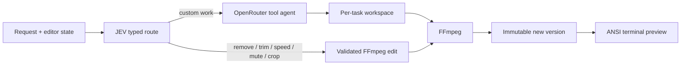

# DumbEditor

**A zero UX video editor that lives entirely in your terminal.**

DumbEditor turns plain language into small, reversible FFmpeg edits. JEV routes each request to a built-in edit or, when configured, an OpenRouter agent for custom work. The source video is never overwritten.

## What works in v0.1

- ANSI true color video preview inside the terminal
- Play/pause, five second seeking, preview audio, and volume controls
- In and out marks for referring to “this section”
- Remove one or more ranges
- Keep or trim to one range
- Speed up or slow down a range
- Mute a range
- Crop to explicit dimensions and optional coordinates
- Immutable version history with undo, revert, and branching
- Export the active version anywhere
- JEV intent routing with confidence gating
- Optional OpenRouter tool agent with a separate workspace per task

## Requirements

- Node.js 20 or newer
- `ffmpeg`, `ffprobe`, and optionally `ffplay` on `PATH`
- A TypeSafe API key for JEV
- An OpenRouter key only for edits routed to the agent

## Install and run

```bash
npm install
npm run build
npm link

dumbeditor setup
dumbeditor video.mp4
```

During development:

```bash
npm run dev -- video.mp4
```

`dumbeditor setup` asks for the required JEV key and an optional OpenRouter key with hidden input, then writes them to `~/.dumbeditor/.env`. You can also copy `.env.example` to a project `.env`. The setup-managed user config takes precedence, followed by the current directory and the package-local `.env` used in development. Keep all `.env` files out of Git.

Without OpenRouter, direct edits still work. Requests routed to the agent stop with a clear configuration message. If JEV rejects a missing, expired, or invalid credential, rerun `dumbeditor setup` with an active TypeSafe key.

## Controls

| Input | Action |
| --- | --- |
| `Space` | Play or pause |
| `←` / `→` | Seek backward or forward five seconds |
| `↑` / `↓` | Change preview volume |
| `[` / `]` | Set the in and out marks |
| `Enter` | Send the current request |
| `Esc` | Clear input or close a panel |
| `Ctrl+C` | Quit |

The command line stays active beneath the video:

```text
remove from 0 to 2.5 seconds and from 01:20 to the end
keep from 00:10 to 00:42
speed up this section at 2x
mute from 14 seconds to 18 seconds
crop to 1280x720
```

Timestamps accept seconds, `mm:ss`, `hh:mm:ss`, milliseconds, `start`, `end`, and `playhead`.

## Slash commands

```text
/open <path>       Open or switch to a source video
/version [all]     Show version history
/revert <id>       Switch to any saved version
/undo              Switch to the current version's parent
/export <path>     Copy the active version to a destination
/status            Show active media and version details
/clear             Clear the visible conversation
/help              Show controls
/quit              Exit
```

## How it is built



JEV selects a handler from a closed set. Exact timestamps and numeric values are extracted and checked by code before FFmpeg runs. This keeps media execution deterministic while still accepting natural phrasing.

Each source gets a project directory beside it:

```text
.dumbeditor/<video-name>-<hash>/
  project.json
  chat.jsonl
  versions/
  agent/
```

Reverting changes the active version pointer. Existing renders and descendants stay in history, so a new edit after a revert creates a branch safely.

The agent receives the saved conversation and a copy of the active video. Its tools can inspect media, write helper or subtitle files, run FFmpeg, and return a validated playable output. Tool paths, FFmpeg inputs, outputs, protocols, and path-bearing options are checked against the per-task workspace. This is an application boundary rather than an operating system security sandbox; run DumbEditor with the same care as other local developer tools.

## Development

```bash
npm run check
npm test
npm run build
```

## License

MIT
