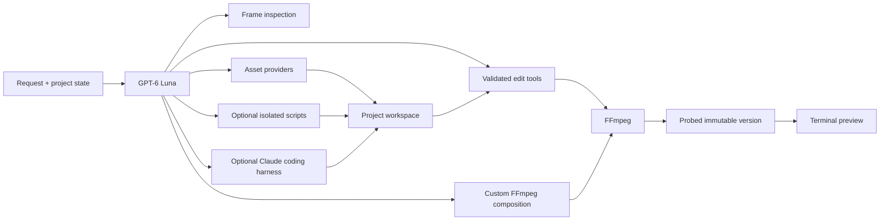

# DumbEditor

**An agent first video editor that lives entirely in your terminal.**

DumbEditor exists for edits that should not require a wall of buttons, several tutorials, or a credit hungry AI interface. Describe the result you want, preview it in the terminal, and keep every render reversible. FFmpeg performs edits locally; GPT-6 Luna plans and checks multi-step work.

## V1 features

- High resolution Sixel video preview in supported terminals, with an ANSI fallback
- Stable player, timeline, chat, combined session/version sidebar, and asset sidebar
- Playback, five second seeking, marks, preview audio, and volume controls
- A real GPT-6 Luna tool loop that can inspect frames and chain several edits
- Ask and automatic permission modes for model changes, custom provider parameters, and coding-harness delegation
- Optional Claude Agent SDK specialist for workspace scripts and tools that do not fit the prepared edit layer
- Remove, keep, speed, mute, and crop tools
- Automatic speech transcription and burned subtitles, plus text overlays, timed image overlays, fades, and ranged visual effects
- Background music mixing with original audio, volume, looping, trim, and delayed start
- Image, speech, music, and video asset generation through configured provider models
- A general FFmpeg composition tool for edits beyond the prepared actions
- Searchable CC BY 4.0 background music with preview, persistent selection, source, and attribution
- Project workspace for generated assets, subtitle files, notes, and scripts
- Immutable versions with undo, revert, branching, export, and configurable retention
- Interactive OpenAI and OpenRouter model catalogs with capability specific pricing units
- Loaders for planning, provider generation, FFmpeg rendering, output checks, and version commits
- Persistent Luna and asset cost ledger with per-asset model and generation cost

## Requirements

- Node.js 20.11 or newer
- `ffmpeg`, `ffprobe`, and optionally `ffplay` on `PATH`
- Windows Terminal 1.22+ or another Sixel terminal for high resolution preview
- An OpenAI API key for Luna
- An optional OpenRouter key for configured image, music, and video generation
- An optional Anthropic API key for the Claude coding harness

## Install and run

```bash
npm install
npm run build
npm link

dumbeditor
dumbeditor setup
dumbeditor video.mp4
dumbeditor --fresh video.mp4
```

For development:

```bash
npm run dev -- video.mp4
```

The first no-argument launch explains why DumbEditor was built and how to start. Later no-argument launches show a short project overview. `dumbeditor --help` prints the full CLI and editor reference.

DumbEditor restores the saved project associated with a source path. Use `dumbeditor --fresh <video>` to delete that source's generated versions, chat, and agent workspace and immediately reopen the untouched source. `dumbeditor clean <video>` performs the same cleanup and exits. Neither command deletes or modifies the source video.

`dumbeditor setup` asks for a required OpenAI key plus optional OpenRouter and Anthropic keys with hidden input. It stores them in `~/.dumbeditor/.env`. Model choices, the Claude harness model, and the permission mode live in `~/.dumbeditor/settings.json`. On Windows, setup also performs the one-time local sandbox installation with one UAC prompt. Setup managed config takes precedence over a current-directory `.env` and the package development `.env`. Secrets are excluded from Git.

## Ask Luna

Write normal requests. Luna receives the active version, media details, playhead, marks, and project conversation. It can inspect sampled frames, call several tools in sequence, recover from a failed tool call, and summarize the versions and assets it created. After a rendered mutation, the runtime requires Luna to inspect output frames before it can finish the run.

```text
remove the first two seconds and mute the last five
inspect the video, create a small badge, and show it at the top right from 4 to 9 seconds
add subtitles to this video
transcribe this interview with speaker diarization, then add subtitles
write these supplied subtitle lines, burn them in, then fade out the final second
use the background music I selected, loop it quietly under the whole video
generate a five second establishing shot of a rainy city for this project
```

The main editor agent is pinned to `gpt-6-luna`. The default economical asset models are:

| Capability | Default |
| --- | --- |
| OpenAI editor | `gpt-6-luna` |
| OpenAI transcription | `gpt-transcribe` |
| OpenAI speech | `gpt-4o-mini-tts` |
| OpenRouter text | `openai/gpt-6-luna` |
| Image | `google/gemini-3.1-flash-lite-image` |
| Music | `google/lyria-3-clip-preview` |
| Video | `google/veo-3.1-lite` |

Provider catalogs and prices change. `/model` loads the current catalog and displays each capability in its billing unit before selection.

Luna may override a configured model and pass provider-specific parameters for one request. In the default `ask` permission mode, DumbEditor displays the provider, model, and parameters and waits for Allow once or Deny. `/permissions auto` lets DumbEditor proceed automatically. The selected defaults remain unchanged unless you change them through `/model`.

For work that needs new code or an unfamiliar tool chain, Luna can delegate a bounded task to Claude Agent SDK. Claude works inside the current project's agent workspace, can read the active video, and uses its own tool permission classifier in auto mode. The integration is optional and only appears when an Anthropic key is configured.

When asked to add subtitles without a supplied file, Luna extracts the audio in short chunks, transcribes it with the configured OpenAI transcription model, creates a timed SRT in the project workspace, and burns it into a new version. Chunked processing keeps long recordings below individual upload limits. Cue timing is estimated within each chunk because the durable default transcription model returns text rather than word timestamps. Luna can request `gpt-4o-transcribe-diarize` when speaker labels are useful; the model switch goes through the active permission policy and produces speaker-timed SRT cues.

## Slash commands

Type `/` to open the scrollable command menu. Use Up and Down to choose, then Tab or Enter to complete a command.

```text
/clip-remove <FROM> <TO> [FROM TO ...]
/clip-keep <FROM> <TO>
/speed <FROM> <TO> <FACTOR>
/mute <FROM> <TO>
/crop <WIDTH>x<HEIGHT> [X,Y]
/open <VIDEO PATH>
/version [all]
/version-limits [1-100]
/revert <VERSION>
/undo
/export [OUTPUT PATH]
/bg-music [QUERY]
/assets
/model
/permissions [ask|auto]
/harness-model [MODEL]
/status
/play
/pause
/clear
/help
/quit
```

Time arguments accept seconds, `mm:ss`, `hh:mm:ss`, `start`, `end`, `playhead`, `in`, and `out`.

`/version-limits 10` keeps the ten newest rendered versions plus the original. The default is five. The source is never overwritten or pruned.

### Export popup

`/export` opens a terminal popup with an editable destination. An optional path after the command pre-fills that field. Choose MP4 or MKV, then select a compression preset:

| Preset | Video | Audio | Use |
| --- | --- | --- | --- |
| No recompression | Stream copy | Stream copy | Fast container change with unchanged quality |
| High quality | H.264 CRF 18 | AAC 192 kb/s | Near-source quality |
| Balanced | H.264 CRF 23 | AAC 160 kb/s | Default quality and size balance |
| Small file | H.264 CRF 28 | AAC 128 kb/s | Easier sharing |

Use Tab to move between destination, format, and compression. Use the arrow keys to edit or select, Enter to export, and Escape to close. DumbEditor renders to a temporary file, validates it with FFprobe, and only then writes the requested destination.

### Music browser

`/bg-music` opens a terminal popup. Type to search by title, genre, mood, artist, or description. Use Up and Down to move, Space to preview or stop, Enter to select, Delete to clear the selection, and Escape to close. The V1 catalog contains explicitly attributed Kevin MacLeod tracks under CC BY 4.0 and keeps each source page and license with the track.

After selection, ask Luna to use the selected background music. Luna downloads the chosen track into the project workspace, records the attribution, and mixes it through the validated local audio tool.

### Model browser

`/model` opens the provider and capability picker. OpenAI exposes editor, transcription, and speech defaults. OpenRouter exposes text, image, audio, music, and video defaults. Type to search. Text shows input and output token prices; transcription shows its duration rate; speech and audio show their provider billing units; image uses image, megapixel, token, or request rates; music shows song or clip rates; video shows the live SKU range and billing unit.

### Agent permissions and coding harness

`/permissions ask` is the default. A centered approval popup appears before a one-run model change, custom provider parameters, or Claude harness delegation. Use Left, Right, or Tab to choose, Enter to confirm, and Escape to deny. `/permissions auto` allows these operations without the DumbEditor popup; Claude's SDK permission classifier still evaluates its internal tool calls.

`/harness-model` shows the configured Claude model. `/harness-model <MODEL>` changes it. Harness runs have a bounded turn count and cost budget, and their reported cost is added to the project ledger.

## Controls

| Input | Action |
| --- | --- |
| `Space` | Play or pause; preview or stop a track in the music popup |
| Left / Right | Seek five seconds; go back or choose in a popup |
| Up / Down | Change volume or move through lists |
| `[` / `]` | Set in and out marks |
| `Tab` | Complete a command or move through a popup |
| `Enter` | Send, complete, or select |
| `Esc` | Clear input or close a panel |
| `Ctrl+C` | Quit and terminate preview processes |
| `Shift+A` | Open or close the project asset browser |

### Assets and cost tracking

The right sidebar lists generated images, video, speech, music, subtitles, and agent workspace files. Each generated asset records its provider model and cost when the provider returns billing data; estimates are marked with `~`. Catalog and local assets are shown as free. Press `Shift+A` or run `/assets` to browse the full list, use Up and Down to select an asset, and press Space to play audio, music, or video. Image and video assets have an inline preview. Start typing to close the browser, restore the main video player, and continue the text in chat.

The chat footer shows the running Luna, harness, asset, and total costs. These values are stored in the source video's `.dumbeditor` project and survive restarts. Luna cost includes every Responses API round in a tool loop, including cached input and reasoning output reported by the API.

## Preview backend

DumbEditor chooses Sixel in Windows Terminal and terminals that advertise Sixel support. Frames are scaled with Lanczos and painted only inside the reserved player surface.

```powershell
$env:DUMBEDITOR_PREVIEW = "blocks"
dumbeditor video.mp4
```

`DUMBEDITOR_CELL_WIDTH` and `DUMBEDITOR_CELL_HEIGHT` override the terminal cell size used for Sixel fitting.

## Agent tools and workspace



Each source has a project directory beside it:

```text
.dumbeditor/<video-name>-<hash>/
  project.json
  chat.jsonl
  versions/
  agent/
    context.jsonl
    workspace/
      assets.json
      assets/
      files/
```

The readable transcript stays in `chat.jsonl`. Raw response items and tool results are appended to the agent ledger. Generated assets and supporting files persist in the project workspace.

The agent uses prepared tools for common work and can build a custom FFmpeg filter graph for combinations that do not have a dedicated command. Filter graph inputs are limited to the active video and registered workspace assets. Luna can send multiple extracted frames to its vision input to inspect the source and audit each rendered result.

The optional Claude harness gives Luna a coding specialist with file, search, and shell tools scoped to the project's `agent/workspace/files` directory. Its shell runs in the Claude SDK sandbox with network disabled, unsandboxed commands forbidden, the active video and project assets readable, only that files directory writable, and provider credentials removed from child commands. DumbEditor owns the outer approval policy, version store, asset ledger, and cost ledger. Claude returns created workspace files to Luna; Luna remains responsible for applying validated edits and auditing the video output.

The agent can also write subtitle files, notes, and scripts inside the workspace. Python and JavaScript scripts run through Anthropic's lightweight Sandbox Runtime, the same open source runtime developed for Claude Code. It uses native OS isolation without a container: a dedicated restricted user and Windows Filtering Platform fence on Windows, Seatbelt on macOS, and bubblewrap plus seccomp on Linux. The active video is read-only, only the current agent workspace is writable, networking is disabled, and API keys are withheld. `dumbeditor setup` performs the one-time Windows sandbox installation with one UAC prompt.

The packaged [`skills`](skills) document the verified video, asset, audio, music, and workspace workflows used by Luna.

## Development

```bash
npm run quality
```

The test suite renders synthetic media with FFmpeg and checks pixels, PCM audio, version commits, input validation, catalog selection, preview lifecycle, and Luna's function-call loop. It does not spend provider credits.

## License

MIT
