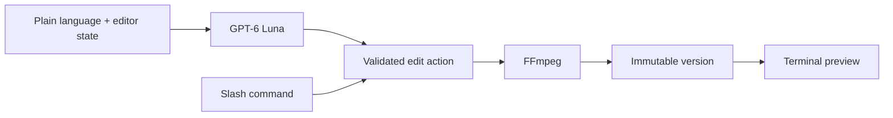

# DumbEditor

**A zero UX video editor that lives entirely in your terminal.**

DumbEditor turns ordinary language into small, reversible FFmpeg edits. GPT-6 Luna understands the request and selects a validated built-in operation. Slash commands provide a direct path when you already know what you want. The source video is never overwritten.

## Current features

- High resolution Sixel video preview in supported terminals, with an ANSI fallback
- Player height matched to the video aspect ratio, with the timeline and chat directly below it
- Stable player and chat surfaces during playback
- Play, pause, five second seeking, preview audio, and volume controls
- Plain language removal, trimming, speed, mute, and crop requests through GPT-6 Luna
- Discoverable slash command menu with keyboard selection and completion
- Progress indicators for AI interpretation, FFmpeg rendering, output checks, and version saving
- Immutable version history with undo, revert, branching, and export
- Optional JEV configuration reserved for later routing modes

## Requirements

- Node.js 20 or newer
- `ffmpeg`, `ffprobe`, and optionally `ffplay` on `PATH`
- Windows Terminal 1.22+ or another Sixel terminal for the high resolution preview
- An OpenAI API key

## Install and run

```bash
npm install
npm run build
npm link

dumbeditor setup
dumbeditor video.mp4
```

During development:

```bash
npm run dev -- video.mp4
```

`dumbeditor setup` asks for an OpenAI key using hidden terminal input. It stores the key in `~/.dumbeditor/.env`. The setup-managed user config takes precedence, followed by a current-directory `.env` and the package-local development `.env`. All `.env` files are excluded from Git.

The default model is `gpt-6-luna`. Set `OPENAI_MODEL` if you want to use another compatible model.

## Natural language editing

Write requests as you normally would. You do not need to memorize timestamp syntax.

```text
remove the first two seconds and the last ten seconds
keep only the part from 00:10 through 00:42
make this marked section twice as fast
mute the next five seconds
crop the video to 1280 by 720
```

The model receives the current duration, playhead, marked range, and recent project conversation. It returns one typed edit action. DumbEditor validates the values before running FFmpeg.

## Slash commands

Type `/` to open the command menu. Use `↑` and `↓` to choose, then `Tab` or `Enter` to complete a command.

```text
/clip-remove <FROM> <TO> [FROM TO ...]
/clip-keep <FROM> <TO>
/speed <FROM> <TO> <FACTOR>
/mute <FROM> <TO>
/crop <WIDTH>x<HEIGHT> [X,Y]
/open <VIDEO PATH>
/version [all]
/revert <VERSION>
/undo
/export <OUTPUT PATH>
/status
/play
/pause
/clear
/help
/quit
```

Direct time arguments accept seconds, `mm:ss`, `hh:mm:ss`, `start`, `end`, `playhead`, `in`, and `out`.

## Controls

| Input | Action |
| --- | --- |
| `Space` | Play or pause |
| `←` / `→` | Seek backward or forward five seconds |
| `↑` / `↓` | Change volume, or move through command suggestions |
| `[` / `]` | Set the in and out marks |
| `Tab` | Complete the selected command |
| `Enter` | Send a request or choose a command |
| `Esc` | Clear input or close a panel |
| `Ctrl+C` | Quit |

## Preview backend

DumbEditor automatically uses Sixel in Windows Terminal and terminals that advertise Sixel support. Frames are scaled with Lanczos and painted only inside the reserved player surface. The timeline updates independently from the conversation.

Force the portable block renderer when needed:

```powershell
$env:DUMBEDITOR_PREVIEW = "blocks"
dumbeditor video.mp4
```

`DUMBEDITOR_CELL_WIDTH` and `DUMBEDITOR_CELL_HEIGHT` override the estimated terminal cell size used to fit Sixel images. The defaults target Windows Terminal with Cascadia Mono.

## Architecture



Each source gets a project directory beside it:

```text
.dumbeditor/<video-name>-<hash>/
  project.json
  chat.jsonl
  versions/
```

Reverting changes the active version pointer. Existing renders and descendants stay in history, so a new edit after a revert creates a branch.

## Development

```bash
npm run quality
```

## License

MIT
