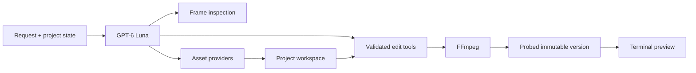

# DumbEditor

**An agent first video editor that lives entirely in your terminal.**

DumbEditor exists for edits that should not require a wall of buttons, several tutorials, or a credit hungry AI interface. Describe the result you want, preview it in the terminal, and keep every render reversible. FFmpeg performs edits locally; GPT-6 Luna plans and checks multi-step work.

## V1 features

- High resolution Sixel video preview in supported terminals, with an ANSI fallback
- Stable player, timeline, chat, version sidebar, and session sidebar
- Playback, five second seeking, marks, preview audio, and volume controls
- A real GPT-6 Luna tool loop that can inspect frames and chain several edits
- Remove, keep, speed, mute, and crop tools
- Text overlays, burned subtitles, timed image overlays, fades, and ranged visual effects
- Background music mixing with original audio, volume, looping, trim, and delayed start
- Image, speech, music, and video asset generation through configured provider models
- Searchable CC BY 4.0 background music with preview, persistent selection, source, and attribution
- Project workspace for generated assets, subtitle files, notes, and scripts
- Immutable versions with undo, revert, branching, export, and configurable retention
- Interactive OpenAI and OpenRouter model catalogs with capability specific pricing units
- Loaders for planning, provider generation, FFmpeg rendering, output checks, and version commits

## Requirements

- Node.js 20 or newer
- `ffmpeg`, `ffprobe`, and optionally `ffplay` on `PATH`
- Windows Terminal 1.22+ or another Sixel terminal for high resolution preview
- An OpenAI API key for Luna
- An optional OpenRouter key for configured image, speech, music, and video generation

## Install and run

```bash
npm install
npm run build
npm link

dumbeditor
dumbeditor setup
dumbeditor video.mp4
dumbeditor --fresh video.mp4
```

For development:

```bash
npm run dev -- video.mp4
```

The first no-argument launch explains why DumbEditor was built and how to start. Later no-argument launches show a short project overview. `dumbeditor --help` prints the full CLI and editor reference.

DumbEditor restores the saved project associated with a source path. Use `dumbeditor --fresh <video>` to delete that source's generated versions, chat, and agent workspace and immediately reopen the untouched source. `dumbeditor clean <video>` performs the same cleanup and exits. Neither command deletes or modifies the source video.

`dumbeditor setup` asks for a required OpenAI key and an optional OpenRouter key with hidden input. It stores them in `~/.dumbeditor/.env`. Model choices live in `~/.dumbeditor/settings.json`. Setup managed config takes precedence over a current-directory `.env` and the package development `.env`. Secrets are excluded from Git.

## Ask Luna

Write normal requests. Luna receives the active version, media details, playhead, marks, and project conversation. It can inspect sampled frames, call several strict tools in sequence, recover from a failed tool call, and summarize the versions and assets it created.

```text
remove the first two seconds and mute the last five
inspect the video, create a small badge, and show it at the top right from 4 to 9 seconds
write subtitles for these lines, burn them in, then fade out the final second
use the background music I selected, loop it quietly under the whole video
generate a five second establishing shot of a rainy city for this project
```

The main editor agent is pinned to `gpt-6-luna`. The default economical asset models are:

| Capability | Default |
| --- | --- |
| OpenRouter text | `openai/gpt-6-luna` |
| Image | `google/gemini-3.1-flash-lite-image` |
| Speech audio | `openai/gpt-audio-mini` |
| Music | `google/lyria-3-clip-preview` |
| Video | `google/veo-3.1-lite` |

Provider catalogs and prices change. `/model` loads the current catalog and displays each capability in its billing unit before selection.

## Slash commands

Type `/` to open the scrollable command menu. Use Up and Down to choose, then Tab or Enter to complete a command.

```text
/clip-remove <FROM> <TO> [FROM TO ...]
/clip-keep <FROM> <TO>
/speed <FROM> <TO> <FACTOR>
/mute <FROM> <TO>
/crop <WIDTH>x<HEIGHT> [X,Y]
/open <VIDEO PATH>
/version [all]
/version-limits [1-100]
/revert <VERSION>
/undo
/export [OUTPUT PATH]
/bg-music [QUERY]
/model
/status
/play
/pause
/clear
/help
/quit
```

Time arguments accept seconds, `mm:ss`, `hh:mm:ss`, `start`, `end`, `playhead`, `in`, and `out`.

`/version-limits 10` keeps the ten newest rendered versions plus the original. The default is five. The source is never overwritten or pruned.

### Export popup

`/export` opens a terminal popup with an editable destination. An optional path after the command pre-fills that field. Choose MP4 or MKV, then select a compression preset:

| Preset | Video | Audio | Use |
| --- | --- | --- | --- |
| No recompression | Stream copy | Stream copy | Fast container change with unchanged quality |
| High quality | H.264 CRF 18 | AAC 192 kb/s | Near-source quality |
| Balanced | H.264 CRF 23 | AAC 160 kb/s | Default quality and size balance |
| Small file | H.264 CRF 28 | AAC 128 kb/s | Easier sharing |

Use Tab to move between destination, format, and compression. Use the arrow keys to edit or select, Enter to export, and Escape to close. DumbEditor renders to a temporary file, validates it with FFprobe, and only then writes the requested destination.

### Music browser

`/bg-music` opens a terminal popup. Type to search by title, genre, mood, artist, or description. Use Up and Down to move, Space to preview or stop, Enter to select, Delete to clear the selection, and Escape to close. The V1 catalog contains explicitly attributed Kevin MacLeod tracks under CC BY 4.0 and keeps each source page and license with the track.

After selection, ask Luna to use the selected background music. Luna downloads the chosen track into the project workspace, records the attribution, and mixes it through the validated local audio tool.

### Model browser

`/model` opens the provider and capability picker. Type to search. Text shows input and output token prices; audio distinguishes token and character rates; image uses image, megapixel, token, or request rates; music shows song or clip rates; video shows the live SKU range and billing unit.

## Controls

| Input | Action |
| --- | --- |
| `Space` | Play or pause; preview or stop a track in the music popup |
| Left / Right | Seek five seconds; go back or choose in a popup |
| Up / Down | Change volume or move through lists |
| `[` / `]` | Set in and out marks |
| `Tab` | Complete a command or move through a popup |
| `Enter` | Send, complete, or select |
| `Esc` | Clear input or close a panel |
| `Ctrl+C` | Quit and terminate preview processes |

## Preview backend

DumbEditor chooses Sixel in Windows Terminal and terminals that advertise Sixel support. Frames are scaled with Lanczos and painted only inside the reserved player surface.

```powershell
$env:DUMBEDITOR_PREVIEW = "blocks"
dumbeditor video.mp4
```

`DUMBEDITOR_CELL_WIDTH` and `DUMBEDITOR_CELL_HEIGHT` override the terminal cell size used for Sixel fitting.

## Agent tools and workspace



Each source has a project directory beside it:

```text
.dumbeditor/<video-name>-<hash>/
  project.json
  chat.jsonl
  versions/
  agent/
    context.jsonl
    workspace/
      assets.json
      assets/
      files/
```

The readable transcript stays in `chat.jsonl`. Raw response items and tool results are appended to the agent ledger. Generated assets and supporting files persist in the project workspace.

The agent can write subtitle files, notes, and scripts inside that workspace. Arbitrary script execution is enabled only through an isolated container runtime. If no supported container is configured, execution fails closed while all built-in FFmpeg tools continue to work. API keys remain in the host process and are never placed in an execution sandbox.

The packaged [`skills`](skills) document the verified video, asset, audio, music, and workspace workflows used by Luna.

## Development

```bash
npm run quality
```

The test suite renders synthetic media with FFmpeg and checks pixels, PCM audio, version commits, input validation, catalog selection, preview lifecycle, and Luna's function-call loop. It does not spend provider credits.

## License

MIT
